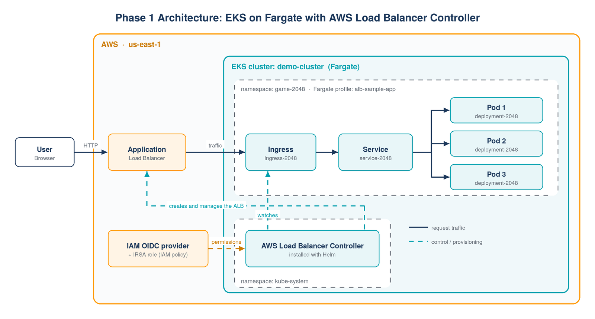
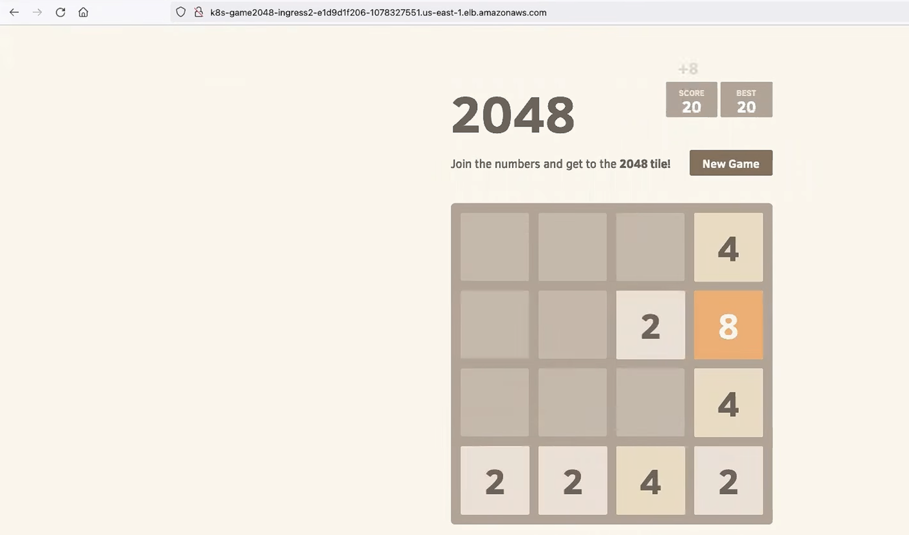

# Microservices Platform on AWS EKS

Hands-on project to build a production-style Kubernetes platform on **Amazon EKS**, step by step:
from a first cluster with an AWS Application Load Balancer, to a 12-component microservices
application deployed with **Terraform, Helm and ArgoCD**, with autoscaling and monitoring.

> **Status:** Phase 1 (EKS + Ingress), Phase 2 (Terraform) and Phase 4 (multi-cluster GitOps) completed.
> Phase 3 (e-commerce app) is in progress — see the [roadmap](#roadmap).

---

## Architecture (Phase 1)



**How it works**

1. `eksctl` creates the EKS cluster with **Fargate**, so there are no EC2 worker nodes to manage.
2. A **Fargate profile** schedules every Pod in the `game-2048` namespace onto Fargate.
3. The cluster's **IAM OIDC provider** enables **IRSA** (IAM Roles for Service Accounts), so the
   AWS Load Balancer Controller gets AWS permissions through a Kubernetes service account instead of static keys.
4. The **AWS Load Balancer Controller** (installed with Helm) watches Ingress objects and
   provisions an internet-facing **Application Load Balancer** automatically.

## Tech stack

| Area | Phase 1 (done) | Next phases |
|---|---|---|
| Cloud | AWS EKS, Fargate, IAM, VPC | EKS provisioned with Terraform |
| Infrastructure as Code | Terraform: VPC, ALB, EC2, S3 (Phase 2) | Terraform EKS module |
| Kubernetes | Deployment, Service, Ingress, IRSA | HPA, namespaces per component |
| Packaging / delivery | Helm (controller), kubectl, Argo CD ApplicationSet (Phase 4) | Helm charts for the e-commerce app |
| Observability | – | Prometheus, Grafana |

## Repository structure

```
.
├── README.md
├── docs/
│   ├── 01-prerequisites.md
│   ├── 02-create-cluster.md
│   ├── 03-oidc-provider.md
│   ├── 04-alb-controller.md
│   ├── 05-deploy-2048-app.md
│   ├── troubleshooting.md
│   └── images/            # architecture diagram and screenshots
├── manifests/
│   └── sample-app/        # nginx Deployment and Service used for a first test
├── scripts/
│   └── cleanup.sh         # deletes all Phase 1 resources to avoid AWS costs
├── phase2-terraform/      # VPC, subnets, ALB, EC2 and S3 with Terraform
└── phase4-gitops-argocd/  # Argo CD hub cluster deploying to 2 spoke clusters
```

## Quick start

```bash
# 1. Create the cluster (about 15-20 min)
eksctl create cluster --name demo-cluster --region us-east-1 --fargate

# 2. Fargate profile for the app namespace
eksctl create fargateprofile --cluster demo-cluster --region us-east-1 \
  --name alb-sample-app --namespace game-2048

# 3. IAM OIDC provider (required for IRSA)
eksctl utils associate-iam-oidc-provider --cluster demo-cluster --approve

# 4. AWS Load Balancer Controller  ->  see docs/04-alb-controller.md

# 5. Deploy the app with Deployment, Service and Ingress
kubectl apply -f https://raw.githubusercontent.com/kubernetes-sigs/aws-load-balancer-controller/v2.5.4/docs/examples/2048/2048_full.yaml

# 6. Get the ALB address and open it in the browser
kubectl get ingress -n game-2048
```

Step-by-step explanations are in [`docs/`](docs/).

## Result

<!-- Replace with your own screenshots -->
| Ingress with ALB address | App in the browser |
|---|---|
|  |  |

## Clean up (important: avoid costs)

An EKS cluster and an ALB are billed per hour. Delete everything when you are done:

```bash
./scripts/cleanup.sh
```

## Roadmap

- [x] **Phase 1:** EKS on Fargate, IRSA, AWS Load Balancer Controller, Ingress
- [x] **Phase 2:** [AWS foundations with **Terraform**](phase2-terraform/): VPC, multi-AZ subnets, ALB, EC2, S3 (refactored with `for_each`, least-privilege security groups, IMDSv2)
- [ ] **Phase 3:** Provision the EKS cluster with Terraform and deploy a 12-component e-commerce app (8 microservices, MongoDB, MySQL, RabbitMQ, Redis) with **Helm**
- [x] **Phase 4:** [Multi-cluster GitOps with **Argo CD**](phase4-gitops-argocd/): hub-and-spoke EKS, ApplicationSet, AppProject, automated sync with self-heal
- [ ] **Phase 5:** Deliver the e-commerce app through Argo CD, with **HPA** autoscaling and **Prometheus/Grafana** monitoring

## What I learned

- Why Fargate needs a profile per namespace, and when managed node groups are the better choice
- How IRSA links a Kubernetes service account to an IAM role through the cluster's OIDC provider
- How the AWS Load Balancer Controller turns an Ingress object into a real ALB
- Debugging an Ingress that has no address (see [troubleshooting](docs/troubleshooting.md))

## Credits

Phase 1 follows the EKS tutorial from Abhishek Veeramalla's
[aws-devops-zero-to-hero](https://github.com/iam-veeramalla/aws-devops-zero-to-hero) course,
re-implemented and documented here in my own setup. The 2048 example manifest is from the
[AWS Load Balancer Controller](https://github.com/kubernetes-sigs/aws-load-balancer-controller) project.

---

**Author:** Md Sanowar Hossain · DevOps Engineer · CKA, CKAD, CKS
[LinkedIn](https://www.linkedin.com/in/HossainSanowar) · [GitHub](https://github.com/hossain-sanowar)
