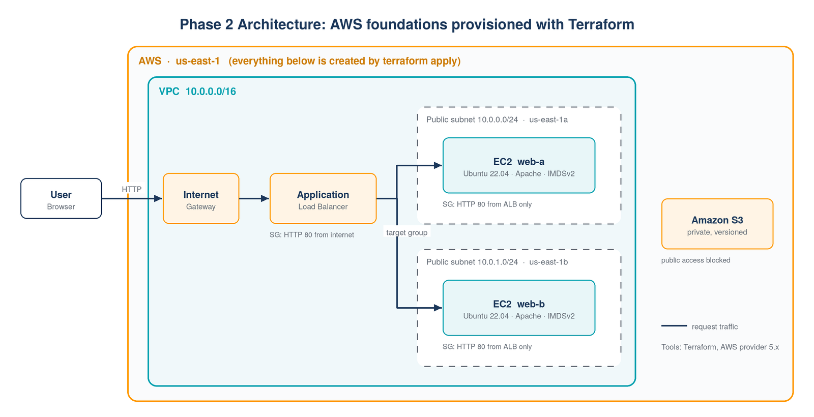

# Phase 2: AWS Foundations with Terraform

Provisions a highly available web tier on AWS with **Terraform**: a VPC with public subnets in
two availability zones, an **Application Load Balancer**, two **EC2** web servers and a private
**S3** bucket. Everything is created with `terraform apply` and removed with `terraform destroy`.



## What gets created

| File | Resources |
|---|---|
| `network.tf` | VPC, 2 public subnets (`for_each`), Internet Gateway, route table + associations |
| `security.tf` | ALB security group (HTTP from internet), web security group (HTTP **from the ALB only**) |
| `compute.tf` | 2 EC2 instances (Ubuntu 22.04 via AMI data source, IMDSv2 enforced, user data from a template) |
| `loadbalancer.tf` | ALB, target group with health checks, target attachments, HTTP listener |
| `storage.tf` | S3 bucket with random suffix, versioning, public access blocked |
| `outputs.tf` | ALB URL, instance IDs, bucket name |
| `userdata.sh.tftpl` | Installs Apache and renders a page showing instance ID and availability zone |

## Improvements over the course version

The base design comes from a course project. I refactored it to follow Terraform and AWS security good practices:

| Course version | My version | Why |
|---|---|---|
| Resources duplicated (`sub1`/`sub2`, `webserver1`/`webserver2`) | `for_each` over a subnet map | Add an AZ by adding one map entry |
| Hard-coded AMI ID | `aws_ami` data source (latest Ubuntu 22.04) | AMI IDs differ per region and get outdated |
| One security group for ALB and servers, SSH open to `0.0.0.0/0` | Separate SGs; servers accept HTTP **only from the ALB**; no SSH | Least privilege, smaller attack surface |
| IMDSv1 metadata calls | IMDSv2 enforced (`http_tokens = "required"`) | Protects against SSRF credential theft |
| Fixed S3 bucket name | Random suffix, versioning, public access block | Bucket names are global; private by default |
| Two near-identical user-data scripts | One `templatefile` with a variable | No duplicated code |
| Exact provider pin, no tags | `~> 5.0`, `required_version`, `default_tags` | Safe updates; every resource is traceable |
| Output inside `main.tf` | Files split by concern, `variables.tf` with types and descriptions | Readable, reviewable code |

## Usage

```bash
cd phase2-terraform
terraform init
terraform fmt -check
terraform validate
terraform plan -out tfplan
terraform apply tfplan

# open the printed URL (wait 1-2 minutes for the health checks)
terraform output alb_dns_name
```

Refresh the page a few times: the instance ID and availability zone change, because the ALB
balances requests across both servers.

## Clean up

```bash
terraform destroy
```

Running cost while it is up: roughly USD 0.05 per hour (ALB + 2 small instances). Destroy it when you are done.

## Result

<!-- Add screenshots from my own deployment -->
| `terraform apply` output | Load-balanced page |
|---|---|
|  |  |

## Next step

Phase 3 reuses these Terraform skills to provision the **EKS cluster** itself (VPC, IAM roles and
node groups with the official `terraform-aws-modules/eks` module), replacing the `eksctl` commands from Phase 1.

## Credits

Based on the Terraform project from Abhishek Veeramalla's
[DevOps course](https://github.com/iam-veeramalla), refactored as described above.
