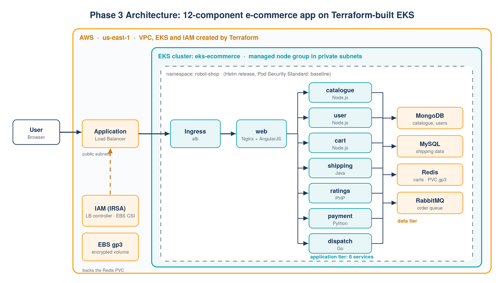

# Phase 3: 12-component E-commerce App on Terraform-built EKS

Deploys **Stan's Robot Shop**, a three-tier microservices shop, onto an **EKS cluster provisioned
with Terraform**: 8 application services (Node.js, Java, Python, Go, PHP, Nginx) and 4 data
components (MongoDB, MySQL, Redis, RabbitMQ), packaged with **Helm** and exposed through an
**AWS Application Load Balancer**.



## What is new compared with Phase 1

| Phase 1 | Phase 3 |
|---|---|
| Cluster created with `eksctl` | **VPC, EKS, node group and IAM roles with Terraform** (official `terraform-aws-modules`) |
| IRSA set up with `eksctl` commands | IRSA roles for the LB controller and EBS CSI driver defined in Terraform |
| Fargate, single sample app | Managed node group in **private subnets**, 12 components |
| No storage | **EBS CSI driver** + encrypted **gp3** StorageClass for Redis |
| Plain manifests | **Helm** chart with configurable values |

## Repository layout

```
phase3-ecommerce-app/
├── terraform/            # VPC (public + private subnets, NAT), EKS, managed node group, IRSA roles
├── helm-robot-shop/      # Helm chart for the 12 components (adapted for EKS)
├── k8s/
│   ├── namespace.yaml        # namespace with Pod Security Standards labels
│   └── storageclass-gp3.yaml # encrypted gp3 volumes via the EBS CSI driver
└── scripts/
    ├── install-lb-controller.sh  # AWS Load Balancer Controller with the Terraform IRSA role
    ├── deploy-app.sh             # Helm install + prints the ALB address
    └── cleanup.sh                # app first, then terraform destroy
```

## Steps

**1. Provision the infrastructure** (about 15-20 minutes)

```bash
cd terraform
terraform init
terraform plan -out tfplan
terraform apply tfplan
$(terraform output -raw configure_kubectl)
kubectl get nodes
```

**2. Install the AWS Load Balancer Controller**

```bash
bash ../scripts/install-lb-controller.sh
```

**3. Deploy the shop**

```bash
bash ../scripts/deploy-app.sh
```

The script waits for the ALB and prints its address. Open it, browse the robots, register a user and place an order.

## Clean up

```bash
bash scripts/cleanup.sh
```

The app is removed first, so the controller deletes the ALB and the EBS volume before Terraform removes
the VPC. Otherwise `terraform destroy` can hang on leftover network interfaces.
Running cost: roughly USD 0.25-0.30 per hour (EKS control plane, 2 × t3.medium, NAT gateway, ALB).

## Improvements over the course version

| Course version | My version | Why |
|---|---|---|
| Cluster, OIDC, IAM roles and add-ons created with `eksctl` commands | Everything in **Terraform** with IRSA modules | Reproducible, reviewable, destroyable with one command |
| Image tag `latest` | Pinned to `2.1.0` | Repeatable deployments |
| `web` Service of type `LoadBalancer` **and** an ALB Ingress (two load balancers) | `ClusterIP` behind the ALB Ingress | One entry point, lower cost |
| Ingress as a separate file with the deprecated `kubernetes.io/ingress.class` annotation | Ingress inside the chart, `ingressClassName: alb`, health-check path | Current API, deployed together with the app |
| Redis StorageClass hard-coded to `gp2` in the template (the value in `values.yaml` was ignored) | Template reads `redis.storageClassName`; encrypted **gp3** StorageClass | Fixes a chart bug; gp3 is cheaper and faster |
| PodSecurityPolicy templates (removed in Kubernetes 1.25) | Removed; namespace uses **Pod Security Standards** (`enforce: baseline`, `warn: restricted`) | Works on current EKS versions |
| MySQL container adds the `NET_ADMIN` capability (only needed for Istio) | Capability removed | Least privilege; passes the baseline standard |
| Helm chart `apiVersion: v1` | `apiVersion: v2` with `appVersion` | Helm 3 format |

## Result

<!-- Add screenshots from my own deployment -->
| `kubectl get pods -n robot-shop` | Shop in the browser via the ALB |
|---|---|
|  |  |

## Credits

The application and the original Helm chart are **Stan's Robot Shop** by Instana
([instana/robot-shop](https://github.com/instana/robot-shop), Apache License 2.0), as used in Abhishek
Veeramalla's three-tier EKS course. The application source code is not copied here: the chart uses
the public `robotshop/rs-*` images. I modified the Helm chart as listed above and wrote the Terraform
code and scripts. The original license is included in [`LICENSE-APACHE-2.0`](LICENSE-APACHE-2.0).
