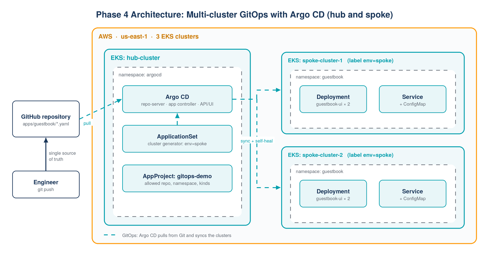

# Phase 4: Multi-cluster GitOps with Argo CD

**Argo CD** runs on a central **hub** EKS cluster and deploys the same application to two
**spoke** EKS clusters. Git is the single source of truth: a change pushed to
`apps/guestbook/` is rolled out to every spoke automatically, and manual changes made with
`kubectl` are reverted (self-heal).



## Why hub and spoke

| Approach | Trade-off |
|---|---|
| Argo CD in every cluster | Simple, but N installations to secure, upgrade and monitor |
| **One Argo CD (hub) managing many clusters** | One control point, one UI, consistent policies; the hub needs access to every spoke |

## Repository layout

```
phase4-gitops-argocd/
├── apps/guestbook/                 # what gets deployed (watched by Argo CD)
│   ├── deployment.yaml
│   ├── service.yaml
│   └── configmap.yaml
├── argocd/
│   ├── argocd-cmd-params-cm.yaml   # HTTP mode for the demo (port-forward only)
│   ├── project.yaml                # AppProject: allowed repo, namespace and resource kinds
│   └── applicationset-guestbook.yaml  # one Application per cluster labelled env=spoke
└── scripts/
    ├── create-clusters.sh          # hub + 2 spokes with eksctl
    ├── register-spokes.sh          # argocd cluster add --label env=spoke
    └── delete-clusters.sh          # remove everything
```

## Steps

**1. Create the clusters** (about 20 minutes, created in parallel)

```bash
bash scripts/create-clusters.sh
```

**2. Install Argo CD on the hub**

```bash
kubectl config use-context <hub-cluster-context>
kubectl create namespace argocd
kubectl apply -n argocd -f https://raw.githubusercontent.com/argoproj/argo-cd/stable/manifests/install.yaml
kubectl apply -f argocd/argocd-cmd-params-cm.yaml
kubectl rollout restart deployment argocd-server -n argocd
```

**3. Log in** (port-forward instead of exposing Argo CD publicly)

```bash
kubectl port-forward svc/argocd-server -n argocd 8080:80 &
argocd admin initial-password -n argocd
argocd login localhost:8080 --username admin --insecure
```

The UI is at http://localhost:8080.

**4. Register the spokes and deploy**

```bash
bash scripts/register-spokes.sh
kubectl apply -f argocd/project.yaml
kubectl apply -f argocd/applicationset-guestbook.yaml
argocd app list      # guestbook-<spoke> apps: Synced / Healthy
```

**5. Show GitOps in action**

```bash
# a) Change the desired state in Git
#    edit apps/guestbook/deployment.yaml: replicas: 2 -> 3, then git commit and push
#    -> Argo CD rolls the change out to both spokes

# b) Self-heal: change a spoke by hand
kubectl --context <spoke-1-context> -n guestbook scale deploy guestbook-ui --replicas=0
#    -> Argo CD restores the replica count from Git within seconds
```

## Clean up

```bash
bash scripts/delete-clusters.sh
```

Three EKS control planes plus small nodes cost roughly USD 0.60-0.80 per hour. Delete them the same day.

## Improvements over the course version

| Course version | My version | Why |
|---|---|---|
| Applications created manually in the UI, one per cluster | **ApplicationSet** with a cluster generator (`env=spoke`) | A new spoke gets the app just by being labelled |
| `default` project, no restrictions | **AppProject** limited to this repo, the `guestbook` namespace and 3 resource kinds | Least privilege for GitOps |
| Manual sync | `automated` sync with `prune` and `selfHeal` | Git really is the source of truth |
| Argo CD server exposed via NodePort | `kubectl port-forward` | Not reachable from the internet |
| Manifests without labels, resources or probes | Recommended labels, requests/limits, readiness and liveness probes, ConfigMap used via `envFrom` | Production-style manifests |
| 3 clusters with default `m5.large` nodes | `t3.medium` hub, `t3.small` spokes, parallel creation | Lower cost and faster setup |

## Result

<!-- Add screenshots from my own deployment -->
| Argo CD UI: apps Synced/Healthy | Self-heal after manual scale-down |
|---|---|
|  |  |

## Credits

Based on the hub-and-spoke Argo CD demo from Abhishek Veeramalla's
[argocd-hub-spoke-demo](https://github.com/iam-veeramalla/argocd-hub-spoke-demo) (Apache License 2.0).
The guestbook manifests originate from [argoproj/argocd-example-apps](https://github.com/argoproj/argocd-example-apps).
I modified the manifests and added the ApplicationSet, AppProject and scripts, as described above.
The original license is included in [`LICENSE-APACHE-2.0`](LICENSE-APACHE-2.0).
